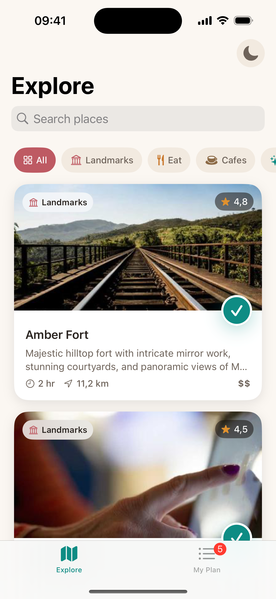
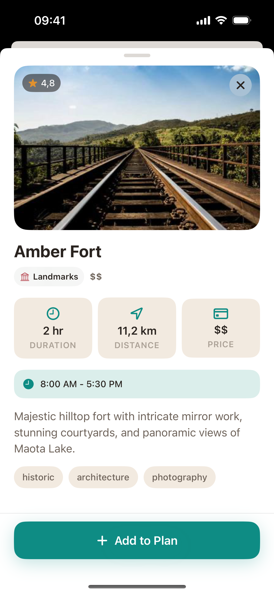
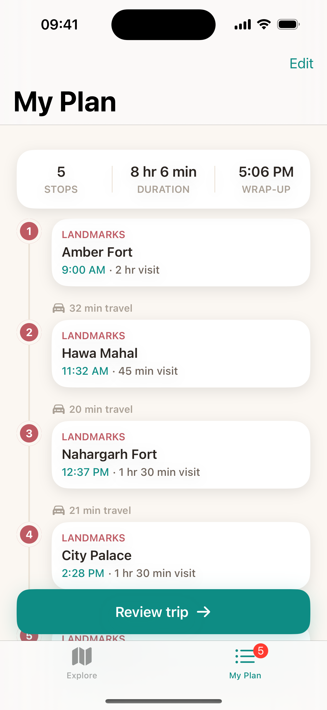
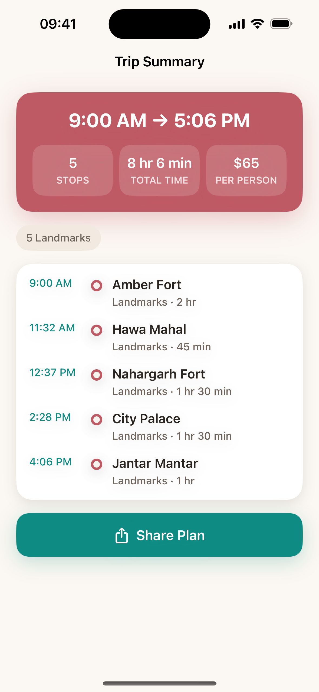

# Wanderly

A small trip day-planner for a single day in Jaipur. You browse points of interest, add the
ones you like to a plan, reorder them into a realistic timeline, and review the finished day.

The brief was written for React Native; I built it natively in SwiftUI, as agreed, since the
role is native iOS and that's where I can show the most craft.

The visual design was prepared with Claude Design and recreated natively in SwiftUI.

| Explore | Place detail | My Plan | Trip Summary |
|---|---|---|---|
|  |  |  |  |

## Running it

- Xcode 16+ and an iOS 17 simulator.
- Open `Wanderly.xcodeproj`, pick the **Wanderly** scheme and an iPhone simulator, and run.
- The first build resolves two SwiftPM dependencies (Kingfisher and the SwiftLint plugin). If
  Xcode asks to trust the SwiftLint build-tool plugin, allow it.

No backend, no setup steps — the 35 places load from a bundled `mock_data.json`.

## How it's put together

The app is split into four local Swift packages under `Modules/`, plus a thin app target that
wires everything up:

- **Domain** — entities (`Place`, `TripPlan`, `TripSummary`…), the repository and use-case
  protocols, the `PlanStore` protocol, and `TripSummaryCalculator` (the scheduling/cost math).
  Pure Swift, no UI.
- **Data** — loads and decodes the bundled JSON into domain models, and the in-memory plan store.
- **DesignSystem** — colour/spacing/type tokens (light + dark) and the reusable views
  (cards, chips, timeline pieces, buttons, snackbar, skeleton…).
- **Features** — one product per tab: `ExploreFeature` (browse + the detail sheet) and
  `PlanFeature` (the itinerary + the summary).

Dependencies only ever point one way: `Features` and `Data` depend on `Domain`, `DesignSystem`
depends on `Domain`, and the app target is the only place that knows about the concrete `Data`
types. Features never import each other — when Explore needs to send you somewhere it does it
through an injected closure, so the two tabs stay independent. Each screen is plain MVVM, and
each feature exposes a small factory (`ExploreFactory` / `PlanFactory`) that builds its view with
its dependencies.

## State management

The itinerary is shared across all four screens, so it lives behind a `PlanStore` protocol in
Domain. The concrete `InMemoryPlanStore` holds the plan and broadcasts every change through an
`AsyncStream<TripPlan>`; view models subscribe and recompute from there.

I went with a protocol + stream rather than reaching for a library because it keeps the feature
layer ignorant of where the plan actually lives, gives one source of truth, and is trivial to
fake in tests (the Explore filter test injects a stub store). For an app this size that's plenty;
I didn't want to pull in a state-management framework I'd have to justify.

## Tech choices

- **SwiftUI** throughout, iOS 17 minimum — lets me use `NavigationStack`, `.searchable`, and
  sheet detents without home-grown equivalents.
- **Swift 6 language mode with complete strict concurrency**, across both the app target and all
  four packages. The view models, the theme controller and the plan store are `@MainActor`, the
  domain models are `Sendable`, and the build is clean under the compiler's full data-race checks.
- The view models and shared state use the **Observation** framework (`@Observable`) rather than
  `ObservableObject`/`@Published`, since we target iOS 17.
- **Kingfisher** for the remote placeholder images — the Explore list scrolls through 35 of them,
  and its caching/downsampling keeps that smooth.
- **SwiftLint** runs as a build-tool plugin in every module.
- **swift-testing** for the unit tests.

## What I deliberately kept native

The prototype shows some custom interactions; I leaned on the platform instead and noted it here:

- The detail view is a real sheet with `.presentationDetents([.medium, .large])` rather than a
  hand-built draggable sheet.
- Delete is `.swipeActions` + an undo snackbar; reordering is `List`'s own drag (via the Edit
  button) instead of a custom always-on drag handle.
- Search is `.searchable`, so it collapses with the large title the way iOS users expect.

These are more robust and far less code; the trade-off is they don't match the prototype's custom
gestures one-for-one.

## In-memory usage

The brief states that in-memory state is fine, so the plan is intentionally kept in memory only
and isn't persisted across launches — a deliberate choice rather than a gap. If persistence were
needed, saving the selected place IDs (and their order) to `UserDefaults` and rehydrating on
launch would be the obvious next step.

## Tests

Focused on the logic that's worth protecting rather than blanket coverage. Run them per package
(open the package in Xcode, or `xcodebuild test`):

- **Domain** — the schedule, travel-gap clamp, the 10-hour boundary, cost and category breakdown.
- **Data** — DTO mapping (including the odd `$$$$` price level), bundle decoding, and the store's
  add/remove/move/undo plus the broadcast stream.
- **Features** — Explore's category + search filtering.
